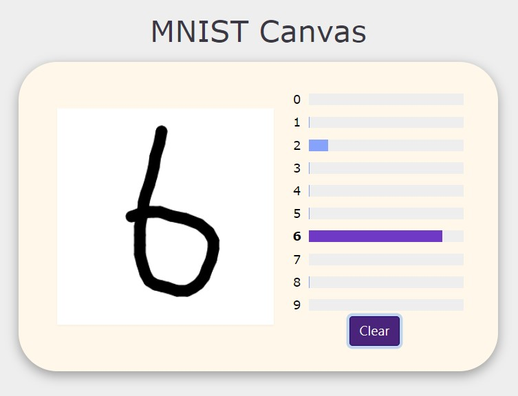

# [mnist-canvas page](https://ruiyangju.github.io/mnist-canvas/)

  

## Introduction
A web canvas that you can draw and see the MNIST classification result distribution.

## Requirements
* Python 3.6+
* Pytorch 0.4.0+
* Pandas 0.23.4+
* NumPy 1.14.3+

## Usage
  Train the model:
  
      python3 main.py
  
  Convert pth to onnx:
  
      python3 convert.py

  optional arguments:
  
      --lr                default=1e-3    learning rate
      --epoch             default=10      number of epochs tp train for
      --trainBatchSize    default=128     training batch size
      --testBatchSize     default=128     test batch size
      --optimizer         default=adam    optimizer
      
## Results
We use GPU RTX 3050 to train MobileNetv2 model on MNIST dataset.
For more details, you can read [mobilenetv2_detail.txt](mobilenetv2_detail.txt).

| Model | MNIST Test Accuracy (%) | FLOPs (G) | MAdd (G) | Memory (MB) | #Params (M) |
| :---: | :---: | :---: | :---: | :---: | :---: |
| MobileNetV2 | 99.13 | 2.42 | 4.75 | 384.78 | 2.37 |

## 上課內容：
* HTML -> 網站上的物件有哪些
* CSS -> 物件要長怎樣
* javascript -> 物件怎麼動
